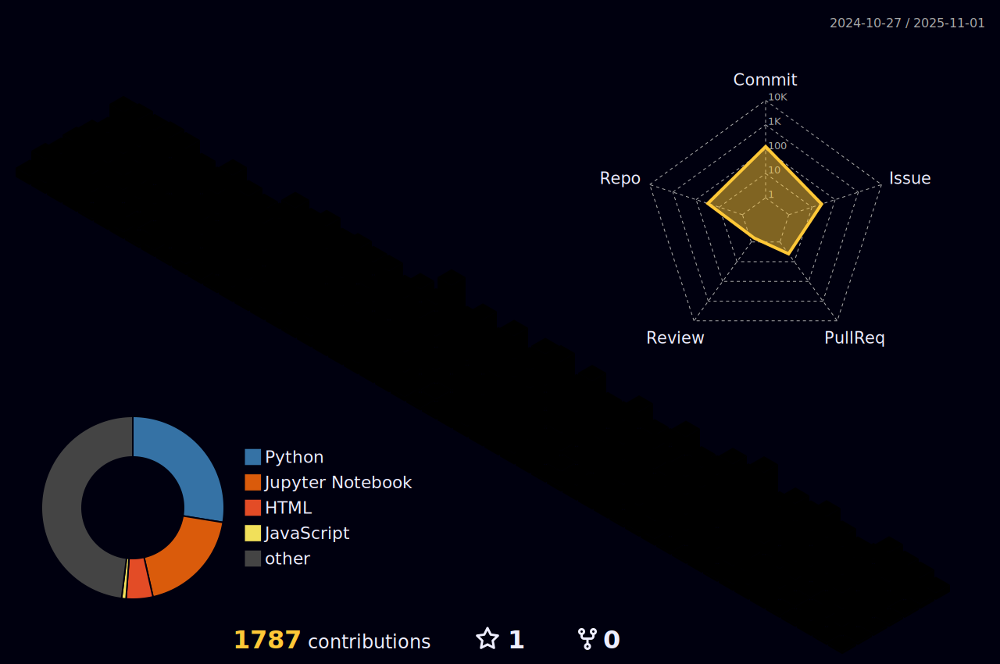

<h1 align="center">Hi 👋, I'm Asra Hussain</h1>
<h3 align="center">Data Scientist </h3>
 
 

  <!-- Typing SVG by MMuttalib1326 - https://github.com/MMuttalib1326/readme-typing-svg -->
  

  

- 🔭 I’m currently working on [Kaggle](https://www.kaggle.com/asrahussain)

- 👨‍💻 All of my projects are available at [https://www.kaggle.com/asrahussain](https://www.kaggle.com/asrahussain)

- 📫 How to reach me **asrahussain0206@gmail.com**

- 💬 Ask me about *| Machine Learning | Artificial Intelligence | Deep Learning | NLP | Computer Vision | Tableau | PowerBi | Excel *

<h3 align="left">Connect with me:</h3>

<h3 align="left">Languages and Tools:</h3>

  
  
  
  
  
  
  
  
  
  
  
  
  
  
  
  
  
  
  
  
  
  
  

Stats: 

  <picture>
    <source media="(prefers-color-scheme: light)" srcset="profile-3d-contrib/profile-night-rainbow.svg" width = "98%">
    
  </picture>

<h2 align="center">🤝 Support</h2>

💙 If you like my projects, Give them ⭠and Share it with friends!

<em><b>I love connecting with different people</b> so if you want to say <b>hi, I'll be happy to meet you more!</b> 😊</em>

<h1 align='center'>⚡️<i>Stay awesome!</i>⚡️</h1>

<h4 align="center">
  <a href="https://asra020601.github.io/portfolio/" title="Portfolio">🔎 Show More 🔍</a>
</h4>
